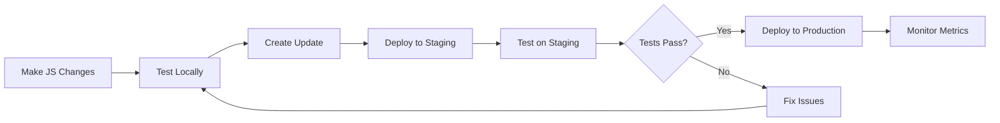

# EduPlatform Mobile Deployment Guide

Complete guide for building, deploying, and managing mobile app releases for iOS and Android.

## Table of Contents

1. [Prerequisites](#prerequisites)
2. [Initial Setup](#initial-setup)
3. [Environment Configuration](#environment-configuration)
4. [Build Profiles](#build-profiles)
5. [iOS Deployment](#ios-deployment)
6. [Android Deployment](#android-deployment)
7. [OTA Updates](#ota-updates)
8. [Release Process](#release-process)
9. [Staged Rollouts](#staged-rollouts)
10. [Monitoring & Analytics](#monitoring--analytics)
11. [Rollback Procedures](#rollback-procedures)
12. [Troubleshooting](#troubleshooting)

## Prerequisites

### Required Tools

- Node.js 18+ and npm/yarn
- EAS CLI: `npm install -g eas-cli`
- Expo account with appropriate permissions
- Git with proper access to repository

### Required Accounts

- **Expo Account**: For EAS Build and Updates
- **Apple Developer Account**: For iOS deployment
  - App Store Connect access
  - Certificate management access
- **Google Play Console**: For Android deployment
  - Release management permissions
- **Sentry Account**: For crash reporting
- **Firebase/Amplitude**: For analytics

### Required Files

#### iOS
- Apple Developer credentials
- App Store Connect API key (for automation)
- iOS Distribution Certificate
- Push Notification Certificate
- Provisioning Profiles (Development, Ad Hoc, App Store)

#### Android
- Google Play Service Account JSON key
- Android Keystore file
- Keystore credentials

## Initial Setup

### 1. Install Dependencies

```bash
cd mobile
npm install
```

### 2. Configure EAS CLI

```bash
# Login to Expo
eas login

# Configure project
eas init

# Link project
eas build:configure
```

### 3. Setup Environment Variables

Copy environment files and fill in your values:

```bash
cp .env.example .env.development
cp .env.example .env.staging
cp .env.example .env.production
```

**Required Environment Variables:**

```env
# Expo
EXPO_PROJECT_ID=your-expo-project-id

# API
API_URL=https://api.eduplatform.com

# Sentry
SENTRY_DSN=https://xxx@sentry.io/xxx
SENTRY_ORG=your-organization
SENTRY_PROJECT=your-project
SENTRY_AUTH_TOKEN=your-auth-token

# Firebase
FIREBASE_API_KEY=your-api-key
FIREBASE_PROJECT_ID=your-project-id
# ... other Firebase configs

# Amplitude
AMPLITUDE_API_KEY=your-amplitude-key

# iOS
APPLE_ID=your-apple-id@example.com
APPLE_TEAM_ID=your-team-id
ASC_APP_ID=your-asc-app-id

# Android
ANDROID_KEYSTORE_PASSWORD=your-password
ANDROID_KEY_ALIAS=your-alias
ANDROID_KEY_PASSWORD=your-key-password
```

### 4. Setup Code Signing

#### iOS Code Signing

**Option A: Automatic (Recommended)**
```bash
eas credentials
# Follow prompts to generate certificates
```

**Option B: Manual**
1. Generate certificates in Apple Developer Portal
2. Upload to EAS:
```bash
eas credentials
# Select iOS → Production/Development
# Upload certificate and provisioning profile
```

#### Android Code Signing

**Generate Keystore:**
```bash
keytool -genkeypair -v \
  -storetype PKCS12 \
  -keystore eduplatform.keystore \
  -alias eduplatform-key \
  -keyalg RSA \
  -keysize 2048 \
  -validity 10000
```

**Upload to EAS:**
```bash
eas credentials
# Select Android → Production
# Upload keystore file
```

### 5. Configure Google Services

Place Google Service files in mobile root:
- `google-services-dev.json`
- `google-services-staging.json`
- `google-services-prod.json`
- `GoogleService-Info-dev.plist`
- `GoogleService-Info-staging.plist`
- `GoogleService-Info-prod.plist`

### 6. Setup Sentry

```bash
# Install Sentry CLI
npm install -g @sentry/cli

# Login to Sentry
sentry-cli login

# Create Sentry project (if not exists)
sentry-cli projects create eduplatform-mobile
```

### 7. Configure Firebase/Amplitude

Follow respective platform documentation to:
- Create projects
- Configure iOS/Android apps
- Download configuration files
- Set up analytics events

## Environment Configuration

### Development Environment

For local development and testing:

```bash
export APP_ENV=development
npm run build:dev:ios     # iOS development build
npm run build:dev:android # Android development build
```

**Characteristics:**
- Uses development API endpoints
- Debug mode enabled
- No crash reporting/analytics
- Hot reload enabled
- Simulator/emulator compatible

### Staging Environment

For internal testing and QA:

```bash
export APP_ENV=staging
npm run build:preview:ios     # iOS preview build
npm run build:preview:android # Android preview build
```

**Characteristics:**
- Uses staging API endpoints
- Crash reporting enabled
- Analytics enabled
- OTA updates enabled
- Ad-hoc distribution (iOS) or APK (Android)

### Production Environment

For app store releases:

```bash
export APP_ENV=production
npm run build:prod:ios     # iOS production build
npm run build:prod:android # Android production build
```

**Characteristics:**
- Uses production API endpoints
- Full crash reporting and analytics
- Performance optimization enabled
- Code obfuscation (Android)
- OTA updates enabled
- Store-ready builds

## Build Profiles

### Development Profile

**Purpose:** Local development and testing

```bash
npm run build:dev:ios
npm run build:dev:android
npm run build:dev:all
```

**Configuration:**
- Development client enabled
- Simulator builds (iOS)
- APK output (Android)
- Internal distribution
- Debug mode

### Preview Profile

**Purpose:** Internal testing, QA, stakeholder demos

```bash
npm run build:preview:ios
npm run build:preview:android
npm run build:preview:all
```

**Configuration:**
- Ad-hoc provisioning (iOS)
- APK output (Android)
- Staging environment
- Crash reporting enabled
- OTA updates enabled

### Production Profile

**Purpose:** App store submission

```bash
npm run build:prod:ios
npm run build:prod:android
npm run build:prod:all
```

**Configuration:**
- App Store provisioning (iOS)
- AAB output (Android)
- Production environment
- Full monitoring enabled
- Store-ready builds

## iOS Deployment

### Build for iOS

#### Development Build
```bash
npm run build:dev:ios
```

#### Preview Build (TestFlight)
```bash
npm run build:preview:ios
```

#### Production Build (App Store)
```bash
npm run build:prod:ios
```

### Submit to App Store

#### Automated Submission
```bash
# Submit to TestFlight (beta testing)
npm run submit:beta:ios

# Submit to App Store (production)
npm run submit:ios
```

#### Manual Submission
1. Build the app
2. Download .ipa from EAS dashboard
3. Upload to App Store Connect via Transporter
4. Configure app metadata in App Store Connect
5. Submit for review

### iOS Release Checklist

- [ ] Update version number in package.json
- [ ] Update build number in app.config.js
- [ ] Run tests: `npm run test:ci`
- [ ] Run linter: `npm run lint`
- [ ] Build for production: `npm run build:prod:ios`
- [ ] Upload source maps to Sentry
- [ ] Submit to TestFlight
- [ ] Test on TestFlight
- [ ] Create release notes
- [ ] Submit to App Store
- [ ] Monitor crash reports
- [ ] Deploy OTA update (if needed)

### Automated iOS Release

Use the release script for guided deployment:

```bash
npm run release:ios
```

This script will:
1. Prompt for build profile
2. Handle version bumping
3. Run tests and linting
4. Build the app
5. Upload source maps
6. Submit to App Store
7. Create OTA update
8. Create git tags

## Android Deployment

### Build for Android

#### Development Build
```bash
npm run build:dev:android
```

#### Preview Build (Internal Testing)
```bash
npm run build:preview:android
```

#### Production Build (Google Play)
```bash
# AAB for Google Play
npm run build:prod:android

# APK for direct distribution
npm run build:prod:android-apk
```

### Submit to Google Play

#### Automated Submission
```bash
# Internal testing
npm run submit:alpha:android

# Beta testing
npm run submit:beta:android

# Production release
npm run submit:android
```

#### Manual Submission
1. Build the app
2. Download .aab from EAS dashboard
3. Upload to Google Play Console
4. Configure release details
5. Set staged rollout percentage
6. Submit for review

### Android Release Checklist

- [ ] Update version number in package.json
- [ ] Update version code in app.config.js
- [ ] Run tests: `npm run test:ci`
- [ ] Run linter: `npm run lint`
- [ ] Build for production: `npm run build:prod:android`
- [ ] Upload source maps to Sentry
- [ ] Submit to internal testing track
- [ ] Test internally
- [ ] Create release notes
- [ ] Submit to production track
- [ ] Configure staged rollout
- [ ] Monitor crash reports
- [ ] Deploy OTA update (if needed)

### Automated Android Release

Use the release script for guided deployment:

```bash
npm run release:android
```

This script will:
1. Prompt for build profile
2. Handle version bumping
3. Run tests and linting
4. Build the app
5. Upload source maps
6. Submit to Google Play
7. Configure staged rollout
8. Create OTA update
9. Create git tags

## OTA Updates

OTA (Over-The-Air) updates allow you to push JavaScript-only changes without going through app store review.

### When to Use OTA Updates

**Use OTA for:**
- Bug fixes in JavaScript code
- UI/UX improvements
- Content updates
- Analytics/tracking changes
- Non-native feature updates

**Don't use OTA for:**
- Native code changes
- New native dependencies
- Permission changes
- Version/build number changes
- Major features requiring app store review

### Create OTA Update

#### Preview/Staging Channel
```bash
npm run update:preview -- "Fix login button styling"
# or
eas update --branch staging --message "Fix login button styling"
```

#### Production Channel
```bash
npm run update:production -- "Fix critical bug in profile screen"
# or
eas update --branch production --message "Fix critical bug"
```

### OTA Update Best Practices

1. **Test thoroughly** - OTA updates bypass app store review
2. **Use semantic messages** - Help track what changed
3. **Monitor closely** - Watch crash reports after deployment
4. **Version carefully** - Keep track of OTA versions
5. **Have rollback ready** - Know how to revert if needed

### Check Active Updates

```bash
# Check updates on production channel
node scripts/check-updates.js production

# Check updates on staging channel
node scripts/check-updates.js staging
```

### OTA Update Workflow



## Release Process

### Standard Release Process

#### 1. Pre-Release

```bash
# Create release branch
git checkout -b release/v1.2.0

# Update version
npm version minor  # or patch/major

# Update CHANGELOG.md
# Document all changes
```

#### 2. Testing

```bash
# Run all tests
npm run test:all

# Run linter
npm run lint

# Type check
npm run type-check

# Build preview versions
npm run build:preview:all
```

#### 3. Build & Submit

```bash
# Automated (recommended)
npm run release:full

# Or manual
npm run build:prod:all
npm run submit:ios
npm run submit:android
```

#### 4. Post-Release

```bash
# Create git tag
git tag -a v1.2.0 -m "Release 1.2.0"
git push origin v1.2.0

# Merge to main
git checkout main
git merge release/v1.2.0
git push origin main

# Create OTA update
npm run update:production -- "Initial release 1.2.0"
```

#### 5. Monitor

- Check Sentry for crash reports
- Monitor Firebase/Amplitude analytics
- Watch user feedback
- Track staged rollout progress

### Hotfix Release Process

For urgent production fixes:

```bash
# Create hotfix branch from main/production
git checkout -b hotfix/v1.2.1 main

# Make fixes
# ... edit files ...

# Test thoroughly
npm run test:ci

# Update version (patch only)
npm version patch

# Deploy via OTA if possible
npm run update:production -- "Hotfix: Fix critical login bug"

# If native changes required
npm run build:prod:all
npm run submit:ios
npm run submit:android

# Merge back
git checkout main
git merge hotfix/v1.2.1
git push origin main
git tag -a v1.2.1 -m "Hotfix 1.2.1"
git push origin v1.2.1
```

## Staged Rollouts

Staged rollouts allow gradual release to minimize risk.

### iOS Staged Rollout (Phased Release)

Configure in App Store Connect:

1. Go to App Store Connect → Your App → Version
2. Enable "Phased Release for Automatic Updates"
3. Apple automatically releases to:
   - Day 1: 1% of users
   - Day 2: 2% of users
   - Day 3: 5% of users
   - Day 4: 10% of users
   - Day 5: 20% of users
   - Day 6: 50% of users
   - Day 7: 100% of users

**Monitor and pause if needed:**
- Watch crash rate in Sentry
- Monitor user feedback
- Pause rollout if issues detected
- Resume when fixed

### Android Staged Rollout

Configure during submission or in Google Play Console:

```bash
# Submit with staged rollout
eas submit --platform android --profile production
# Then configure rollout percentage in Google Play Console
```

**Recommended Rollout Strategy:**

| Stage | Percentage | Duration | Action |
|-------|-----------|----------|--------|
| 1 | 5% | 24 hours | Monitor closely |
| 2 | 10% | 24 hours | Check metrics |
| 3 | 25% | 24 hours | Review feedback |
| 4 | 50% | 24 hours | Final checks |
| 5 | 100% | - | Full release |

**Increase rollout percentage:**
1. Go to Google Play Console
2. Navigate to Release → Production
3. Click "Manage rollout"
4. Increase percentage
5. Save changes

**Halt rollout if issues detected:**
1. Click "Pause rollout"
2. Fix issues
3. Deploy patch
4. Resume rollout

### Beta Testing Groups

#### iOS TestFlight

1. Create external test group in App Store Connect
2. Add testers via email or public link
3. Submit beta build
4. Collect feedback

```bash
npm run submit:beta:ios
```

#### Android Closed Testing

1. Create closed testing track in Google Play Console
2. Add testers via email list
3. Submit build to closed track
4. Share opt-in link

```bash
npm run submit:alpha:android
```

## Monitoring & Analytics

### Crash Reporting (Sentry)

#### Dashboard Access
- URL: https://sentry.io/organizations/[your-org]/projects/
- Monitor crash rate, affected users, error trends

#### Key Metrics to Monitor
- Crash-free sessions rate (target: >99.9%)
- Crash-free users rate (target: >99.5%)
- Most common errors
- Performance issues

#### Alert Configuration
Set up alerts for:
- Crash rate spike (>0.1%)
- New error types
- Performance degradation
- User-affecting issues

### Analytics (Firebase/Amplitude)

#### Key Metrics
- Daily/Monthly Active Users (DAU/MAU)
- Session duration
- Screen views
- User retention
- Feature usage
- Conversion funnels

#### Custom Events
Track important app events:
- User signup/login
- Feature usage
- Purchase events
- Errors/failures
- Engagement metrics

#### Dashboards
Create dashboards for:
- User acquisition
- Engagement metrics
- Feature adoption
- Conversion rates
- Technical health

### Performance Monitoring

#### Firebase Performance
- App start time
- Screen rendering time
- Network request latency
- Custom traces

#### Key Performance Indicators
- App launch time (<2s target)
- Time to interactive (<3s target)
- API response time (<500ms target)
- Frame rate (60fps target)

## Rollback Procedures

### OTA Update Rollback

#### Quick Rollback
```bash
# List recent updates
eas update:list --branch production

# Rollback to previous update
eas update:rollback --branch production
```

#### Specific Version Rollback
```bash
# Find update ID from list
eas update:list --branch production

# Rollback to specific update
eas update:republish --update-id [UPDATE_ID] --branch production
```

### App Store Rollback

#### iOS App Store
1. App Store Connect → My Apps → [Your App]
2. App Store → App Store Versions
3. Click on previous version
4. Click "Submit for Review" to restore

**Note:** Cannot rollback instantly; requires review process

#### Google Play Rollback

**Immediate Rollback:**
1. Google Play Console → Release → Production
2. Find version to rollback to
3. Click "Roll back" button
4. Confirm rollback

**Percentage Reduction:**
1. Navigate to current release
2. Reduce staged rollout percentage
3. Users will gradually receive previous version

### Emergency Procedures

#### Critical Bug Detected

1. **Immediate Actions:**
   ```bash
   # Pause staged rollout (if active)
   # - iOS: App Store Connect → Pause Phased Release
   # - Android: Google Play Console → Pause rollout
   
   # Remove from stores (extreme cases)
   # - iOS: Remove from sale in App Store Connect
   # - Android: Deactivate in Google Play Console
   ```

2. **Communication:**
   - Notify team immediately
   - Prepare user communication
   - Update status page

3. **Fix & Deploy:**
   ```bash
   # Create hotfix branch
   git checkout -b hotfix/critical-fix
   
   # Fix the issue
   # ... make changes ...
   
   # Test thoroughly
   npm run test:ci
   
   # Deploy OTA update (if JS-only fix)
   npm run update:production -- "Emergency fix: [description]"
   
   # Or full build (if native changes)
   npm run release:full
   ```

4. **Verify & Resume:**
   - Monitor crash reports
   - Verify fix effectiveness
   - Resume rollout gradually
   - Communicate resolution

### Rollback Decision Matrix

| Issue Severity | User Impact | Action | Timeline |
|---------------|-------------|--------|----------|
| Critical | >10% users | Immediate rollback | <1 hour |
| High | 1-10% users | Rollback + hotfix | <4 hours |
| Medium | <1% users | Hotfix only | <24 hours |
| Low | Minimal | Regular patch | Next release |

## Troubleshooting

### Build Failures

#### iOS Build Fails

**Certificate/Provisioning Issues:**
```bash
# Regenerate credentials
eas credentials --platform ios

# Clear local credentials cache
eas credentials --clear-cache

# Try build again
npm run build:prod:ios
```

**Code Signing Errors:**
- Verify bundle ID matches provisioning profile
- Check certificate expiration
- Ensure correct team ID
- Update Xcode if needed

#### Android Build Fails

**Keystore Issues:**
```bash
# Verify keystore
keytool -list -v -keystore eduplatform.keystore

# Re-upload to EAS if needed
eas credentials --platform android
```

**Gradle Errors:**
- Check Android SDK version
- Verify dependencies compatibility
- Clear gradle cache: `cd android && ./gradlew clean`

### Submission Failures

#### iOS Submission Issues

**Common Errors:**
- Invalid binary
- Missing icons/screenshots
- Export compliance issues
- Privacy policy missing

**Solutions:**
1. Verify all assets included
2. Update App Store Connect metadata
3. Check export compliance settings
4. Ensure privacy policy URL is valid

#### Android Submission Issues

**Common Errors:**
- APK/AAB signing issues
- Target API level outdated
- Permissions not declared
- Content rating missing

**Solutions:**
1. Verify signing configuration
2. Update target SDK version
3. Declare all permissions in manifest
4. Complete content rating questionnaire

### OTA Update Issues

**Update Not Appearing:**
```bash
# Check update published
eas update:list --branch production

# Verify channel configuration in app.config.js
# Check expo-updates is installed
npm list expo-updates

# Force check for updates in app
# Use otaUpdateService.forceUpdate()
```

**Update Causing Crashes:**
```bash
# Immediate rollback
eas update:rollback --branch production

# Check Sentry for error details
# Fix issues
# Deploy new update
npm run update:production -- "Fix for previous update"
```

### Performance Issues

**Slow Builds:**
- Use larger resource class in eas.json
- Clear EAS cache
- Optimize dependencies

**App Performance:**
- Profile with React DevTools
- Check bundle size
- Optimize images/assets
- Review analytics for bottlenecks

### Common Errors Reference

| Error | Cause | Solution |
|-------|-------|----------|
| `UNAUTHORIZED` | Invalid credentials | Re-login with `eas login` |
| `BUNDLE_ID_MISMATCH` | Bundle ID doesn't match | Update app.config.js |
| `CERTIFICATE_EXPIRED` | iOS cert expired | Regenerate with `eas credentials` |
| `KEYSTORE_ERROR` | Android signing issue | Re-upload keystore |
| `UPDATE_NOT_COMPATIBLE` | Runtime version mismatch | Update runtime version |
| `NETWORK_ERROR` | Connection issue | Check internet, retry |

## Support & Resources

### Documentation
- [EAS Build](https://docs.expo.dev/build/introduction/)
- [EAS Submit](https://docs.expo.dev/submit/introduction/)
- [EAS Update](https://docs.expo.dev/eas-update/introduction/)
- [Sentry React Native](https://docs.sentry.io/platforms/react-native/)
- [Firebase for React Native](https://rnfirebase.io/)
- [Amplitude React Native](https://amplitude.com/docs/sdks/analytics/react-native/react-native-sdk)

### Support Channels
- Expo Forums: https://forums.expo.dev/
- Discord: https://chat.expo.dev/
- Stack Overflow: Tag with `expo` and `react-native`

### Internal Contacts
- Technical Lead: [Name/Email]
- DevOps Team: [Email]
- QA Team: [Email]
- Release Manager: [Name/Email]

## Appendix

### Release Checklist Template

```markdown
# Release v[VERSION] Checklist

## Pre-Release
- [ ] Create release branch
- [ ] Update version numbers
- [ ] Update CHANGELOG.md
- [ ] Run full test suite
- [ ] Run linter
- [ ] Type check
- [ ] Code review completed

## Build
- [ ] Build preview versions
- [ ] Test preview builds
- [ ] Build production versions
- [ ] Verify build artifacts

## Submission
- [ ] Submit to TestFlight/Internal Testing
- [ ] Beta test with test group
- [ ] Submit to App Store
- [ ] Submit to Google Play
- [ ] Configure staged rollout

## Post-Release
- [ ] Create git tag
- [ ] Merge to main branch
- [ ] Upload source maps
- [ ] Create OTA update
- [ ] Update documentation
- [ ] Notify stakeholders

## Monitoring
- [ ] Monitor crash reports (24h)
- [ ] Check analytics metrics (48h)
- [ ] Review user feedback (72h)
- [ ] Verify staged rollout progress
- [ ] Document any issues
```

### Environment Variables Reference

See `.env.example` for complete list of required and optional environment variables.

### Build Time Estimates

| Build Type | iOS | Android | Both |
|-----------|-----|---------|------|
| Development | 8-12 min | 10-15 min | 15-20 min |
| Preview | 12-18 min | 15-20 min | 20-30 min |
| Production | 15-25 min | 18-25 min | 25-40 min |

*Times vary based on project size and EAS resource class*

---

**Last Updated:** [Date]  
**Document Version:** 1.0  
**Maintained By:** [Team Name]
